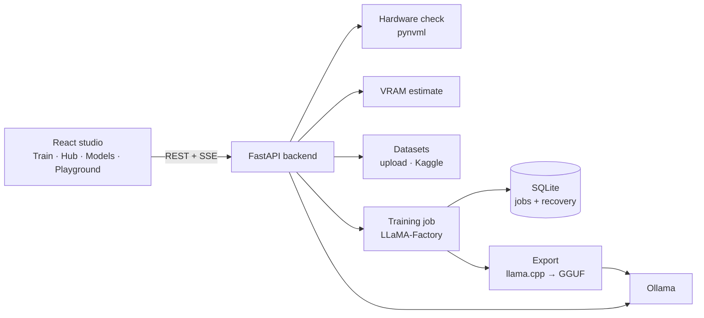

# Forge AI Studio

**Fine-tune open LLMs on your own machine, from a browser.**

Forge is a local studio for LoRA, QLoRA and full fine-tuning. It checks your GPU, estimates whether a job fits in memory before you start it, runs the training through LLaMA-Factory, streams the logs live, and exports the result to GGUF so you can chat with it in Ollama a minute later.

I built it because setting up a local fine-tune usually means an afternoon of version conflicts, a config file you have to guess at, and a run that dies at 80% from running out of memory. With Forge the goal is clone to first running job in under 2 minutes.


## What it does

| Step | What happens | Where in the code |
|---|---|---|
| Hardware check | Detects an NVIDIA GPU through `pynvml` (name, memory, utilisation, temperature), and falls back to CPU or Apple Silicon info | `services/hardware_service.py` |
| Memory estimate | Estimates VRAM for a job from model size, method (QLoRA, LoRA or full), batch size and sequence length, before anything starts | `utils/vram_calculator.py` |
| Models | Searches the Ollama library and Hugging Face, pulls models with live progress, cancel and delete | `routers/models.py` |
| Datasets | Uploads JSON or CSV, previews rows, searches Kaggle | `routers/datasets.py`, `services/kaggle_service.py` |
| Training | Writes the LLaMA-Factory config (LoRA rank, alpha, epochs, learning rate, batch size, chat template) and runs it as a background job | `services/training_service.py` |
| Live logs | Streams training logs and parsed loss to the browser over server-sent events | `routers/training.py`, `utils/log_parser.py` |
| Recovery | Every job is stored in SQLite, and interrupted jobs are recovered when the server restarts | `services/persistence.py` |
| Export | Converts the fine-tuned model to GGUF with llama.cpp and registers it with Ollama | `services/model_export_service.py` |
| Playground | Chat with any local or fine-tuned model, streamed token by token | `routers/chat.py` |

## How it fits together



## Results

I used Forge to LoRA fine-tune 3 models on consumer GPUs, including two 2B-parameter models.

## Quick start

Requirements: Python 3.11+, Node 18+, and an NVIDIA GPU for real training. Without a GPU, Forge still runs, and training jobs fall back to a simulated run so you can try the full interface (set `ALLOW_SIMULATION_FALLBACK=false` in `.env` to turn that off).

```bash
git clone https://github.com/TashonBraganca/Forge.git
cd Forge/forge-backend
cp .env.example .env
python start.py
```

`start.py` checks your Python version and GPU, installs missing Python packages, installs and starts Ollama if needed, clones LLaMA-Factory, starts the frontend and opens the studio in your browser.

Manual setup:

```bash
# backend
cd forge-backend
pip install -r requirements.txt
python main.py

# frontend, in a second terminal
cd fromtedn
npm install
npm run dev
```

The studio opens at `http://localhost:3004`.

## API

All routes sit under `/api`.

| Method | Path | Purpose |
|---|---|---|
| GET | `/api/health` | Hardware stats |
| GET | `/api/models/ollama`, `/api/models/ollama/search`, `/api/models/huggingface` | List and search models |
| POST | `/api/models/pull/{name}` | Pull a model, with progress |
| POST | `/api/datasets/upload` | Upload a dataset |
| GET | `/api/datasets/kaggle/search` | Search Kaggle |
| POST | `/api/training/start` | Start a fine-tuning job |
| GET | `/api/training/stream/{job_id}` | Live training logs |
| POST | `/api/training/export/{job_id}` | Export to GGUF and Ollama |
| POST | `/api/chat/stream` | Streamed chat |

## Stack

Backend: Python, FastAPI, Uvicorn, SQLite, pynvml, LLaMA-Factory, llama.cpp, Ollama.
Frontend: React 19, Vite, TypeScript, Tailwind CSS, Zustand, Framer Motion.

## Roadmap

- [x] Ollama and Hugging Face model search and pulls
- [x] Persistent jobs with recovery
- [x] Dataset upload and Kaggle search
- [x] GGUF export to Ollama
- [ ] Multi-GPU training
- [ ] Built-in eval runs before and after fine-tuning
- [ ] Dataset labelling tool

Built by [Tashon Braganca](https://github.com/TashonBraganca).
